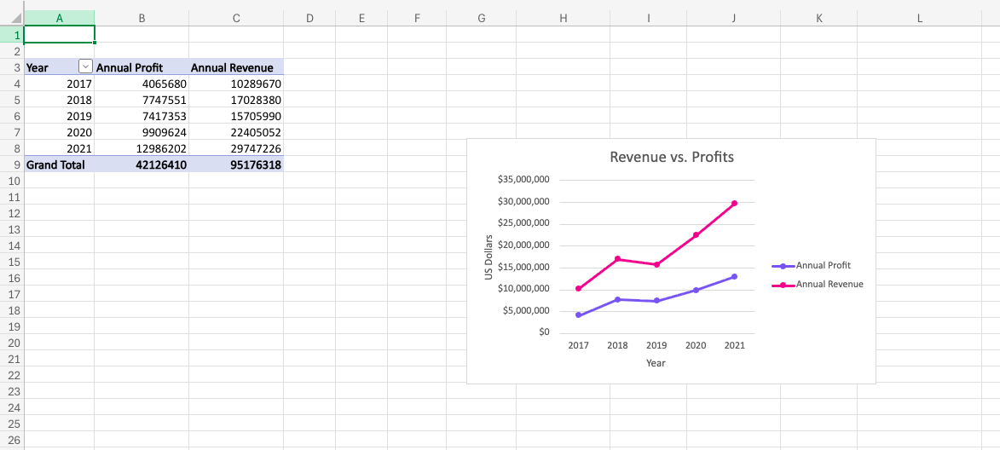
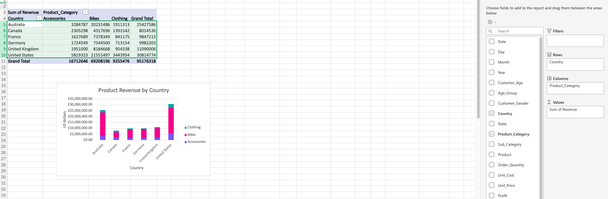
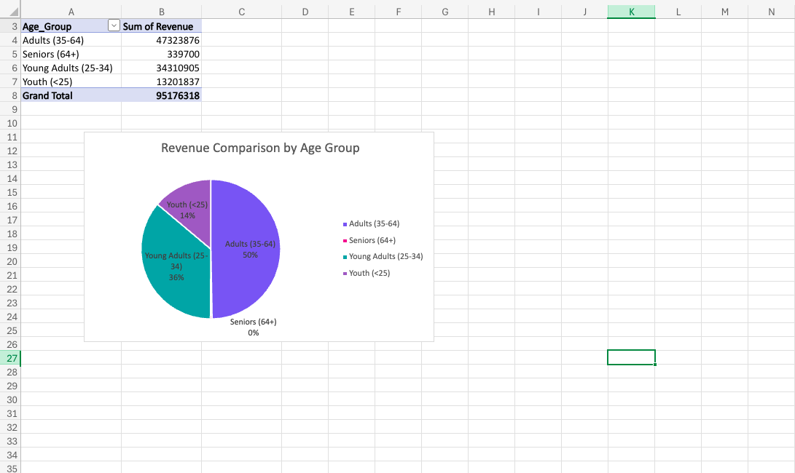

# 📊  Excel-Bike-Sales-Visualisation-Project

This project is an Excel-based analysis of a bike sales dataset.  
It demonstrates my skills as an **Entry-Level Data Technician**, focusing on analysis and interpretation of data.

---

## 🎯 Project Overview
The goal of this project is to practice creating pivot tables charts in Microsoft Excel. Data visualization assists with the analysis and interpretation of data by graphically presenting relationships, trends, and inferences that cannot always be clearly derived by examining the raw text and numeric values in a dataset.

---

## 🧰 Skills & Techniques Used

### 🎛️ **Pivot Tables for Line Chart**
I built a pivot table to summarize sales by:
- Year 
- Annual profit
- Annual Revenue

These pivot table help extract insights from the dataset efficiently.

### 📈 Vizualizing Line Chart
I presented the pivot table as a graphical chart to visualize the summarized data, making it easier to interpret trends and comparisons, and assist in analysis and decision making.

---
### 🎛️ **Pivot Tables for Column Chart**
I built a pivot table to summarize sales by:
- Country
- Product Category
- Product Revenue

  
These pivot table help extract insights from the dataset efficiently.

### 📈 Vizualizing Column Chart
I presented the pivot table as a graphical chart to visualize the summarized data, making it easier to interpret trends and comparisons, and assist in analysis and decision making.

---
### 🎛️ **Pivot Tables for Pie Chart**
I built a pivot table to summarize sales by:
-Age group
-Sum of Revenue

These pivot table help extract insights from the dataset efficiently.

### 📈 Vizualizing Pie Chart
I presented the pivot table as a graphical chart to visualize the summarized data, making it easier to interpret trends and comparisons, and assist in analysis and decision making.

## 📄 Project Files
- **Excel Workbook:** Contains raw data, pivot tables, and charts.
- **Images Folder** Contains all the screeshots using for this README.
 
---

## 🚀 What This Project Demonstrates
- Ability to clean, structure, and analyze data in Excel  
- Building pivot tables for business insights   
- Creating charts and interactive elements to improve data exploration  
